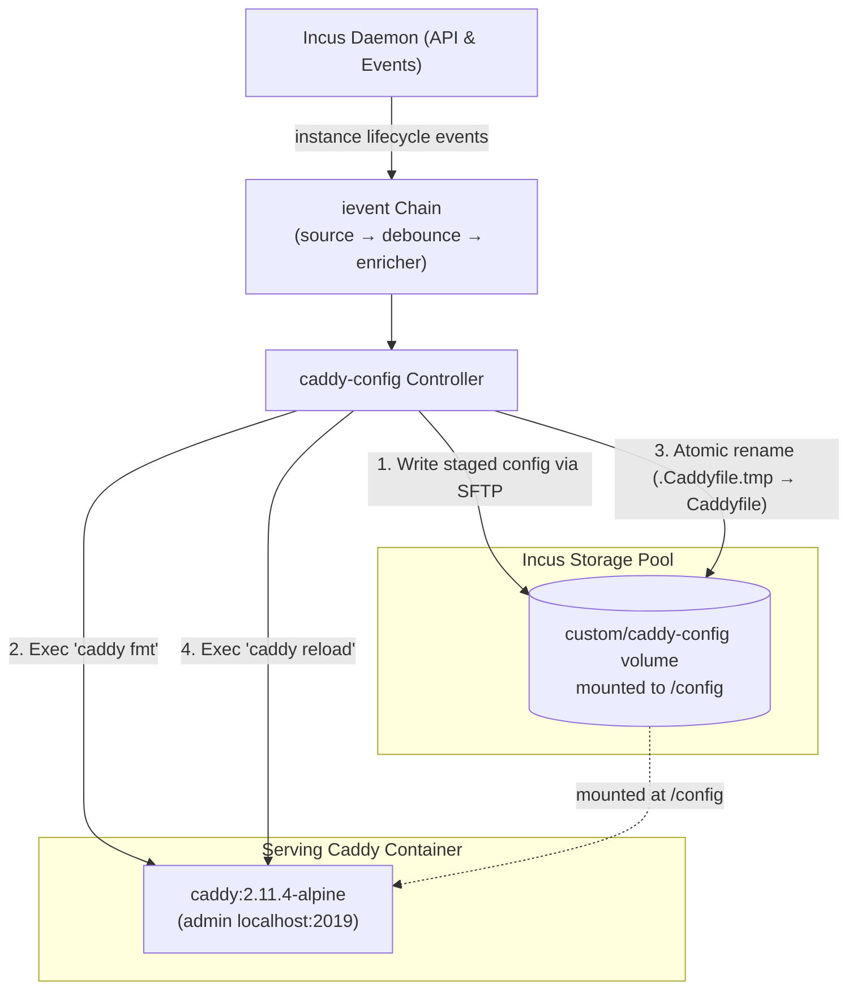

# incus-caddy-config

[](https://github.com/lxc/incus-caddy-config/actions)
[](https://github.com/lxc/incus-caddy-config/actions)
[](LICENSE)

Dynamic, zero-touch reverse proxy configuration for [Caddy](https://caddyserver.com/) on [Incus](https://linuxcontainers.org/incus/), driven by instance events via `ievent`.

```yaml
services:
  caddy:
    image: docker.io/library/caddy:2.11.4-alpine
    restart: unless-stopped
    ports:
      - "80:80"
      - "443:443"
    volumes:
      - caddy-config:/config
      - caddy-data:/data

  api:
    image: docker.io/library/busybox:latest
    command: httpd -f -p 8080
    labels:
      edge.domain: "api.example.com"
      edge.upstream: "8080"

volumes:
  caddy-config:
  caddy-data:
```

```bash
incus-compose up -d
```

`caddy-config` watches your Incus fleet, discovers running instances, and configures reverse proxy routes into Caddy with zero manual configuration.

---

## How It Works

`caddy-config` communicates with Incus exclusively over the Incus API (events, storage volume SFTP, and container exec):



1. **Monitors Fleet**: Subscribes to the Incus event stream and tracks instances carrying target labels.
2. **Direct Storage Volume SFTP**: Connects directly to the underlying Incus storage volume mounted at `/config` over SFTP (`conn.GetStoragePoolVolumeFileSFTP`).
3. **Safe Validation & Formatting**: Renders Caddyfiles in-memory, stages to `/.Caddyfile.tmp`, and verifies/formats configuration syntax with `caddy fmt --overwrite`.
4. **Atomic Swapping & Reload**: Atomically replaces `/config/Caddyfile` using `sftp.PosixRename` and reloads Caddy via container exec.
5. **Reboot & Crash Survival**: If Caddy restarts or the host reboots, Caddy immediately starts up using the persisted configuration on the storage volume. If Caddy is stopped during reconcile, `caddy-config` stages directly onto the volume so it boots with the updated config on next start.

---

## Features

- **Dual Deployment Modes**: Supports deploying to remote Caddy instances in Incus over SFTP (`--caddy-instance [label,]instance=<inst>,project=<proj>[,flags...]`), or local filesystem deployment alongside Caddy on the same OS, container, or VM (`--os-path [label,]path=<path>[,flags...]`). Targets are repeatable or comma/space-separated.
- **Zero Admin Port Exposure**: Caddy's Admin API listens strictly on container loopback (`localhost:2019`). No admin port is published to the host or exposed to the network.
- **Direct Storage Volume SFTP**: Writes directly to the underlying storage volume over the Incus API. `caddy-config` needs no local volume mount or host filesystem access.
- **Single Goroutine Concurrency**: Concurrency model strictly confined to a single goroutine (Rule A4). Zero mutexes, race-free event processing, and orderly reconciliation.
- **Warm Gating**: Reconciliations are suppressed while the event chain is cold (`ChainCold`). Deployments only trigger after the initial fleet sweep completes (`ChainWarm`), eliminating route churn during daemon reconnects.
- **Automatic Load Balancing**: Multiple instances sharing the same domain label are automatically aggregated and sorted into a single load-balanced `reverse_proxy` directive.
- **Custom Vhost & Global Templating**: Supports custom site blocks via external template directories (`--templates-dir`) and overriding the global options block per target via custom template files (`global_template=<path>`).
- **Observability**: Built-in HTTP endpoints on `:9153` for liveness (`/health`), fleet readiness (`/ready`), and Go runtime profiling (`/debug/pprof`).

---

## Quick Start

### 1. Generate an Incus Trust Token

```bash
incus config trust add caddy-config
```

Save the token into `.env` (loaded automatically by `incus-compose` without `--os-env`):

```bash
echo "INCUS_TOKEN=<token>" > .env
```

### 2. Run with `incus-compose`

Create `compose.yaml`:

```yaml
services:
  caddy:
    image: docker.io/library/caddy:2.11.4-alpine
    restart: unless-stopped
    ports:
      - "80:80"
      - "443:443"
    volumes:
      - config:/config
      - data:/data
    command: |
      sh -c 'if [ ! -f /config/Caddyfile ]; then echo -e "{\n\tadmin localhost:2019\n}\n:80 {\n\trespond \"Caddy initializing...\" 503\n}\n" > /config/Caddyfile; fi; exec caddy run --config /config/Caddyfile --adapter caddyfile'

  caddy-config:
    image: ghcr.io/jochumdev/incus-caddy-config/caddy-config:1.0.0-beta.1
    restart: unless-stopped
    depends_on:
      caddy:
        condition: service_healthy
    # ports:
    #   - "9153:9153"
    environment:
      INCUS_CADDY_INCUS: "${INCUS_CADDY_INCUS:-https://10.0.1.1:8443}"
      INCUS_CADDY_DATA_DIR: /var/lib/caddy-config
      INCUS_CADDY_INSTANCES: "edge,instance=caddy-1,project=default"
      INCUS_CADDY_HTTP_ADDRESS: ":9153"
      INCUS_CADDY_LOG: "INFO"
    secrets:
      - token
    volumes:
      - caddy-config:/var/lib/caddy-config

secrets:
  token:
    environment: INCUS_TOKEN

volumes:
  config:
  data:
  caddy-config:
```

Start the stack:

```bash
incus-compose up -d
```

### 3. Route Your First Service

Add labels to any container or virtual machine:

```yaml
services:
  web:
    image: docker.io/library/nginx:alpine
    labels:
      edge.domain: "web.example.test"
      edge.upstream: "80"
```

Deploy the service:

```bash
incus-compose up -d web
```

Caddy immediately discovers the instance and routes traffic:

```bash
curl -H "Host: web.example.test" http://127.0.0.1/
```

---

## Instance Labels Reference

For a target bound to prefix `edge` (`--caddy-instance edge,instance=caddy,project=default` or `--os-path edge,path=/etc/caddy/Caddyfile`):

| Label in `compose.yaml` | Description                                                                                                                           |
| ----------------------- | ------------------------------------------------------------------------------------------------------------------------------------- |
| `edge.domain`           | **(Required)** Domain name(s) with optional flags (e.g. `,redir=https://new.com`, `,template=custom.caddyfile`). Multiple domains separated by spaces. |
| `edge.upstream`         | Upstream port (e.g. `8080`) or `host:port` override (e.g. `10.0.1.5:8080`).                                                           |
| `edge.network`          | Network interface to resolve IPv4 from (e.g. `incusbr0`). Defaults to first non-loopback IPv4.                                        |
| `edge.redirs`           | Alternate redirection domain(s) mapping to primary domain (e.g. `www.example.com,no-uri`).                                            |
| `edge.service`          | Custom service name override (defaults to `user.incus-compose.service`).                                                              |

---

## Documentation

Full documentation is available at [caddy.incus-compose.org](https://caddy.incus-compose.org):

- **[Getting Started](https://caddy.incus-compose.org/getting-started)** - Installation, prerequisites, and first deployment
- **[Architecture & Security](https://caddy.incus-compose.org/architecture)** - Process isolation, volume resolution, and concurrency model
- **[Instance Labels & Routing](https://caddy.incus-compose.org/labels)** - Complete label specification and load balancing
- **[Custom Vhost Templates](https://caddy.incus-compose.org/templates)** - Advanced site blocks, template variables, and examples
- **[Configuration Reference](https://caddy.incus-compose.org/configuration)** - CLI flags, canonical `INCUS_CADDY_*` environment variables, and HTTP endpoints
- **[Deployment & Operations](https://caddy.incus-compose.org/deployment)** - Production compose stacks, reboot survival, and troubleshooting

---

## Support & Community

- **Bug Reports & Issues**: [github.com/lxc/incus-caddy-config/issues](https://github.com/lxc/incus-caddy-config/issues)
- **Community Forum**: [discuss.linuxcontainers.org](https://discuss.linuxcontainers.org)

---

## Contributing

Contributions are welcome! Please read [CONTRIBUTING.md](CONTRIBUTING.md) and [AGENTS.md](AGENTS.md) before submitting pull requests.

---

## License

[Apache 2.0](LICENSE)
