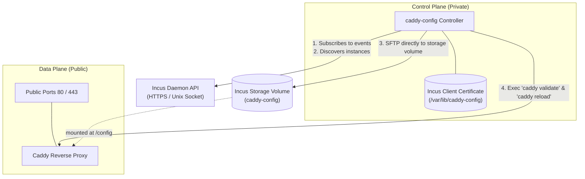
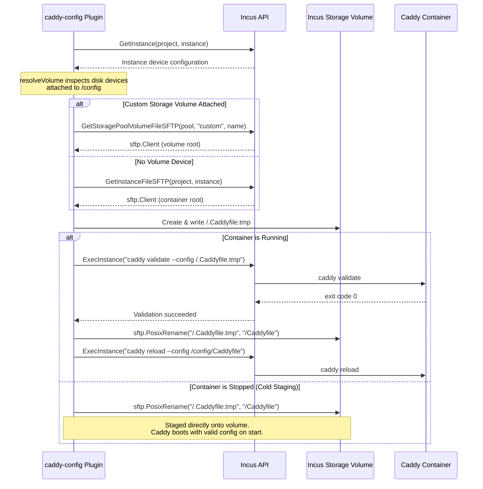
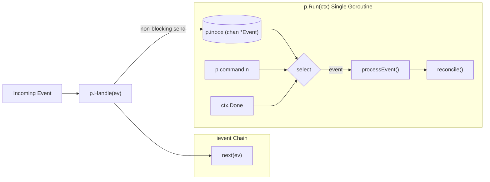

# Architecture & Security

`caddy-config` is designed around strict process isolation, single-goroutine state confinement, and direct storage volume manipulation over the Incus API.

---

## Two-Process Security Model

`caddy-config` separates control-plane responsibilities from the data plane across two isolated processes:

### Process Separation Boundaries

| Property | `caddy-config` | `caddy` |
|---|---|---|
| **Role** | Control-plane event listener & config reconciler | Data-plane HTTP/HTTPS reverse proxy |
| **Network Exposure** | None (internal `:9153` healthcheck only) | Public ports `80` and `443` |
| **Incus Credentials** | Holds client TLS certificate or trust token | **None** (zero access to Incus API) |
| **Caddy Admin API** | Accesses via in-container exec (`caddy reload`) | Bound to `localhost:2019` inside container |
| **Disk Access** | Writes to storage volume via Incus SFTP | Mounts `/config` and `/data` storage volumes |

Because Caddy holds no Incus credentials and its Admin API is bound strictly to `localhost:2019`, a compromised backend service or proxy vulnerability cannot access the Incus API or manipulate container definitions.

---

## Storage Volume Resolution & Direct SFTP Deployer

Caddy persists its configuration in an Incus custom storage volume (e.g. `caddy-config` mounted to `/config`).

Rather than requiring `caddy-config` to mount the storage volume locally on the host or in its own container, `caddy-config` communicates entirely through the Incus API:

### Key Deployment Invariants

1. **Volume Resolution (`resolveVolume`)**:
   `deploy()` inspects the instance's expanded devices to locate a disk device whose mount path matches the parent directory of `--caddyfile-path` (default `/config`). It extracts the `pool` and volume `source` name.
2. **Cold Staging (Reboot & Crash Survival)**:
   If Caddy is stopped, `caddy-config` still updates the Caddyfile on the storage volume. When Caddy starts up or reboots, it reads the updated configuration immediately.
3. **Atomic Swapping**:
   `caddy-config` never writes directly over the active `Caddyfile`. It writes to `/.Caddyfile.tmp` and only renames via `sftp.PosixRename` after in-container validation succeeds.
4. **Validation Isolation**:
   If an invalid route or template syntax error occurs, validation fails in-container. The temporary file is removed, and the active `Caddyfile` remains completely untouched.

---

## Concurrency Model: Single Goroutine Confinement (Rule A4)

All state in `caddy.Plugin` (`instances`, `lastDeployed`, `chain`) is strictly confined to `p.Run(ctx)`'s single goroutine:

- **No Mutexes**: `Plugin` contains zero mutexes (`sync.Mutex` or `sync.RWMutex`) and zero atomic flags.
- **Sequential Event Processing**: Events delivered by `Handle()` are placed into a buffered inbox channel (`p.inbox`) and forwarded along the `ievent` chain immediately.
- **Ordered Reconciles**: `processEvent()` and `reconcile()` execute exclusively on the `Run()` goroutine. Race conditions between concurrent state updates and Caddy reloads are impossible by design.
- **Graceful Drain**: When the chain receives a shutdown command (`iutil.CommandDrain`), `p.Run` drains remaining events in `p.inbox` via `drainInbox()`, forwards the drain command to `p.commandOut`, and exits cleanly.

---

## Warm Gating on Chain State

`caddy-config` coordinates with the `ievent` enricher to avoid flapping routes during startup or daemon reconnection:

- **Cold State (`iutil.ChainCold`)**:
  When the process starts, the enricher performs an initial fleet sweep of all monitored projects. During this sweep, instance events are recorded into `p.instances`, but **all Caddy deployments are gated and paused**.
- **Warm State (`iutil.ChainWarm`)**:
  Once the sweep finishes, the enricher emits `ActionSweepEnd`. `caddy-config` transitions to `ChainWarm` and performs a single initial `reconcile()` deploying the complete routing table.
- **Disconnection Handling**:
  If the Incus event stream disconnects, the state drops to `ChainCold`. Caddy retains its last known good configuration on the storage volume while `caddy-config` reconnects and re-synchronizes the fleet.
