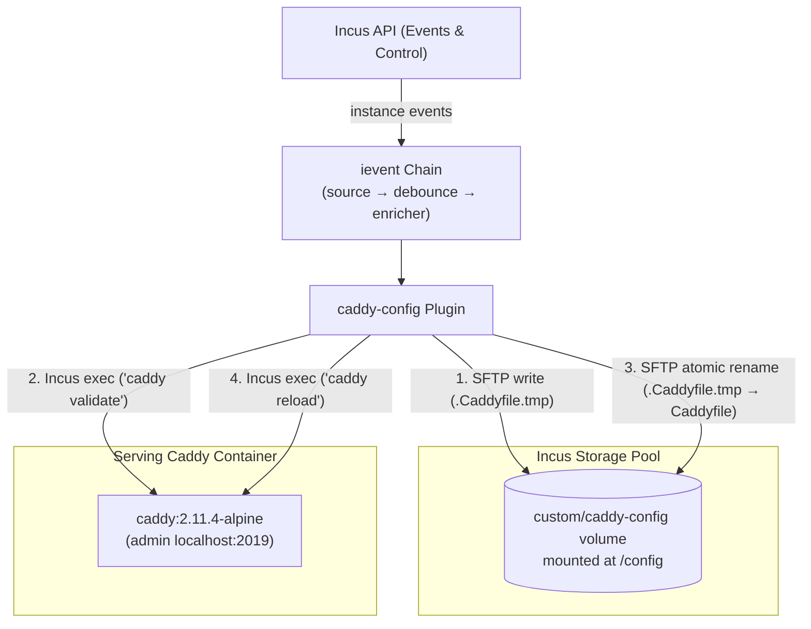

# Incus Caddy Config (`caddy-config`)

Dynamic, zero-touch reverse proxy configuration for [Caddy](https://caddyserver.com/) on [Incus](https://linuxcontainers.org/incus/), driven by instance lifecycle events.

`caddy-config` watches your Incus fleet via the `ievent` stream, renders Caddyfiles from instance labels in real time, validates them in-container, and deploys them directly into persistent storage volumes via Incus SFTP.



## Quick Example

Define Caddy and your backend application in `compose.yaml`:

```yaml
services:
  caddy:
    image: docker.io/library/caddy:2.11.4-alpine
    restart: unless-stopped
    ports:
      - "80:80"
      - "443:443"
    volumes:
      - caddy-config:/config
      - caddy-data:/data

  api:
    image: docker.io/library/busybox:latest
    command: httpd -f -p 8080
    labels:
      edge.domain: "api.example.com"
      edge.upstream: "8080"

volumes:
  caddy-config:
  caddy-data:
```

When `caddy-config` runs with `--caddy-instance edge:default:caddy`, it automatically discovers `api`, resolves its Incus bridge IPv4 address, and renders the reverse proxy block into Caddy:

```caddyfile
{
	admin localhost:2019
}

api.example.com {
	reverse_proxy 10.0.1.42:8080
}
```

When you scale, stop, start, or rename instances, Caddy reloads within milliseconds of the Incus event.

---

## Key Highlights

- **Zero Admin Port Exposure**: Caddy's Admin API is bound strictly to `localhost:2019` inside the container. No admin port is mapped to the host or public network.
- **Direct Storage Volume SFTP**: Configurations are written directly to the underlying Incus storage volume (`conn.GetStoragePoolVolumeFileSFTP`). If Caddy reboots or starts cold, it immediately boots with the current configuration.
- **Safe Atomic Swaps**: Renders in-memory, writes to `/.Caddyfile.tmp`, verifies syntax with `caddy validate` inside the container, and atomically swaps via `sftp.PosixRename`. Broken configurations are rejected before touching the active site.
- **Single Goroutine Concurrency**: State reconciliation is strictly confined to a single goroutine (Rule A4). No mutexes, lock contention, or race hazards.
- **Warm Gating**: Changes are suppressed while the event chain is cold (`ChainCold`). Deployments only run once the fleet sweep completes (`ChainWarm`), eliminating route churn on startup.
- **Flexible Custom Templating**: Full support for custom site blocks via inline Go templates or external template directories (`--custom-templates-dir`).

---

## Documentation Navigation

- [Getting Started](/getting-started) - Prerequisites, installation, and first deployment
- [Architecture & Security](/architecture) - Process isolation, volume resolution, and concurrency model
- [Instance Labels & Routing](/labels) - Label specification, network resolution, and load balancing
- [Custom Vhost Templates](/templates) - Advanced site blocks, template variables, and examples
- [Configuration Reference](/configuration) - CLI flags, environment variables, and HTTP endpoints
- [Deployment & Operations](/deployment) - Production compose stacks, reboot survival, and troubleshooting
